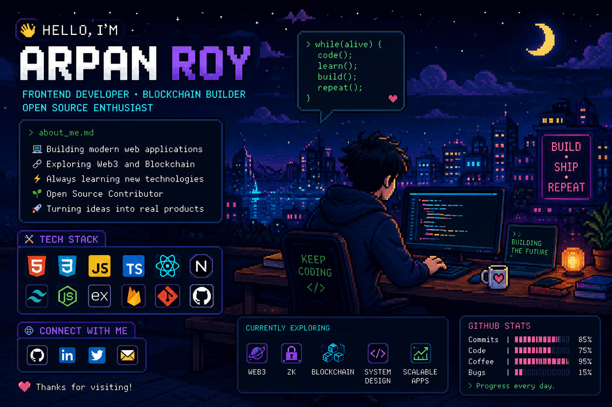

<div align="center">



</div>

<div align="center">

# 👋 Hi, I'm Arpan Roy

### Full-Stack Developer • AI/ML Builder • Web3 Engineer


<br>

<p>
<a href="https://github.com/arg0506"></a>
<a href="https://github.com/arg0506"></a>

</p>

</div>

---

# 💫 About Me

I'm an engineering student and builder who works across **AI/ML, Web3, and full-stack development** — turning hackathon ideas into shipped products.

- 🎓 B.Tech, Government College of Engineering and Leather Technology (GCELT), Kolkata — Class of 2027
- 🧠 Building **AI-powered applications** — from computer vision to conversational agents
- ⛓️ Shipping on **Stellar / Soroban** — tokenized real-world assets, DeFi, and compliance tooling
- 🎨 Weaving **Bengali folk art traditions** (Pattachitra, Alpona, Kalighat) into product design and branding
- 🏆 Active in hackathons, ambassador programs, and dev workshops
- 🎯 Goal: land a software engineering internship and build products people actually use

---

# 🚀 Featured Projects

## 🗳️ Voxis
Privacy-preserving governance platform powered by Zero-Knowledge Proofs on the Midnight Network.

**Highlights**
- Zero-Knowledge Voting
- Compact Smart Contracts
- Modern React UI
- Anonymous Governance

---

## 🌌 Orion
Modern Web3 wallet dashboard built on Stellar Testnet.

**Highlights**
- Freighter Wallet Integration
- Real-Time XLM Dashboard
- Transaction Management
- Firebase Authentication

---

## 🌾 KrishiMitra (কৃষিমিত্র)
AI agricultural advisory platform for Bengali-speaking smallholder farmers.

**Highlights**
- Bengali voice interaction
- Crop disease detection via AI vision models
- Live mandi (market) price feeds
- Weather advisories, built on React + Firebase

---

## 🎵 SurChain
Blockchain-based music royalty and ownership platform, built on Stellar.

**Highlights**
- On-chain royalty distribution
- Verifiable ownership records
- Designed for independent artists
- Full technical architecture + landing page

---

# 🧩 Other Projects

| Project | Description | Tech |
|---|---|---|
| **CarbonLens AI** | Blockchain carbon credit transparency platform with AI trust-scoring & fraud detection | Solidity, React, AI |
| **SoundWave** | Spotify-inspired music streaming app with offline support & audio visualizer | Node.js, MongoDB, Web Audio API |
| **LendFi** | DeFi lending protocol landing page | HTML, CSS, JS |
| **Inkwell** | Dark-themed editorial blog platform | HTML, CSS, JS |
| **Developer Portfolio** | Space-futuristic personal portfolio site | Next.js, Framer Motion |

---

# 🛠 Tech Stack

## 📊 Weekly Development Breakdown

```
AI / ML          ████████░░░░░░░ 30%
Blockchain       ███████░░░░░░░░ 25%
React / Frontend ██████░░░░░░░░░ 22%
Backend          ████░░░░░░░░░░░ 15%
Reading          ██░░░░░░░░░░░░░ 8%
```

### Languages

<p>

</p>

### Frontend

<p>

</p>

### Backend

<p>

</p>

### Blockchain

<p>

</p>

**Also Exploring**
- Stellar / Soroban Smart Contracts
- Midnight Network & Compact
- Zero-Knowledge Applications
- Applied AI / LLM Integrations

### Tools

<p>

</p>

---

# 💼 Current Focus

```
🔭 Building on Stellar/Soroban — tokenized assets, compliance & payments
🌱 Deepening backend & system design skills
⚡ Shipping AI-powered tools with real-world utility
🚀 Iterating on hackathon & SCF grant submissions
🎯 Preparing for Software Engineering internships
```

---

# 📈 Coding Practice

Working through **Striver's A2Z DSA Sheet** and **NeetCode 150** to stay sharp for technical interviews.

<p align="center">

</p>

---

# 📊 GitHub Analytics

<p align="center">


</p>

<p align="center">

</p>

<p align="center">

</p>

<p align="center">

</p>

---

# 🐍 Contribution Graph

<p align="center">

</p>

> ℹ️ This animates once you add the [snake workflow](https://github.com/Platane/snk) to this repo's GitHub Actions.

---

# 📌 What I'm Working On

- 🔹 Stellar/Soroban Web3 applications
- 🔹 AI/ML-powered products
- 🔹 Frontend Engineering (React ecosystem)
- 🔹 Zero-Knowledge & privacy-preserving apps
- 🔹 Open Source Contributions

---

# 🎯 2026 Goals

- 🚀 Ship and scale a Stellar/Soroban hackathon project
- 🧠 Build impactful AI/ML applications with real users
- ⚛️ Master full-stack & backend system design
- 💼 Land a Software Engineering internship
- 🌍 Build products that solve real problems for real people

---

# 🎸 Beyond Code

Co-founder of **The Midnight Echoes**, a three-member indie-pop band based in Kolkata — when I'm not shipping code, I'm writing songs and designing artwork inspired by Bengali folk traditions.

---

# 🏆 Hackathons & Programs

- 🌟 Regular participant in Web3 and AI/ML hackathons, including Stellar/Soroban SCF-aligned tracks
- 🎓 Active in ambassador programs and developer workshops
- 📝 Currently developing hackathon submissions in the tokenized real-world asset and compliance space

---

# 🤝 Let's Collaborate

I'm always up for talking about:

- 🌱 Stellar/Soroban smart contract projects
- 🤖 Applied AI/ML products with real-world use cases
- 🎨 Design work that blends tech with cultural storytelling
- 💼 Software engineering internship opportunities

Feel free to reach out — see below 👇

---

# 🌐 Connect With Me

<p align="left">
<a href="https://github.com/arg0506">

</a>
<a href="https://linkedin.com/in/YOUR_LINKEDIN">

</a>
<a href="https://x.com/YOUR_X">

</a>
<a href="mailto:arpanroy0506@gmail.com">

</a>
</p>

---

<div align="center">

## 💡 Philosophy

> *"Code with curiosity. Build with purpose. Learn continuously."*

⭐ Thanks for visiting my profile!

</div>
